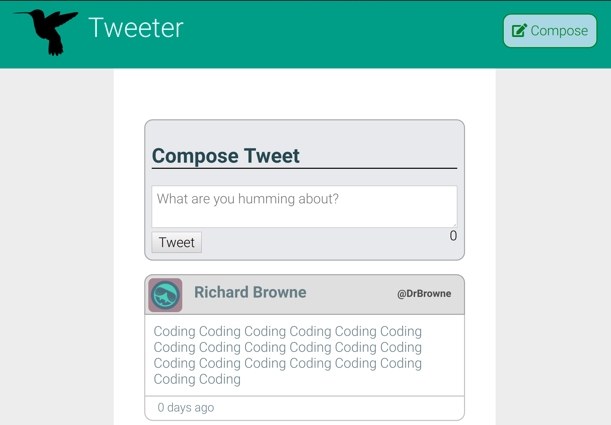
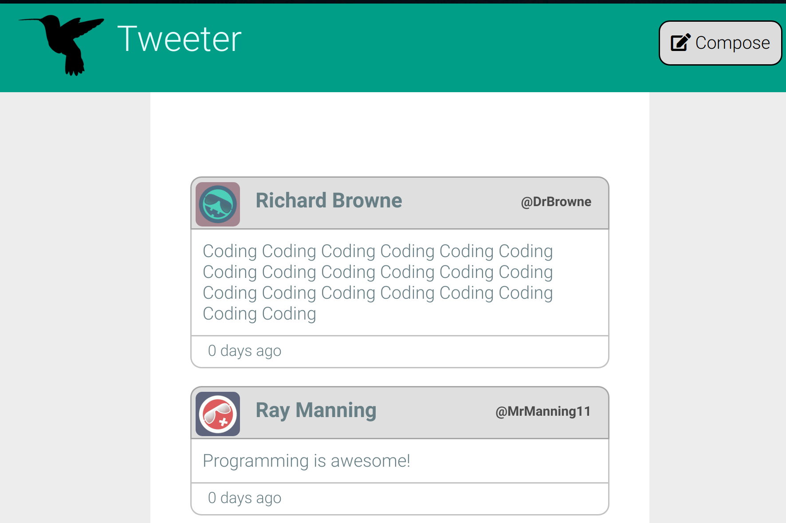
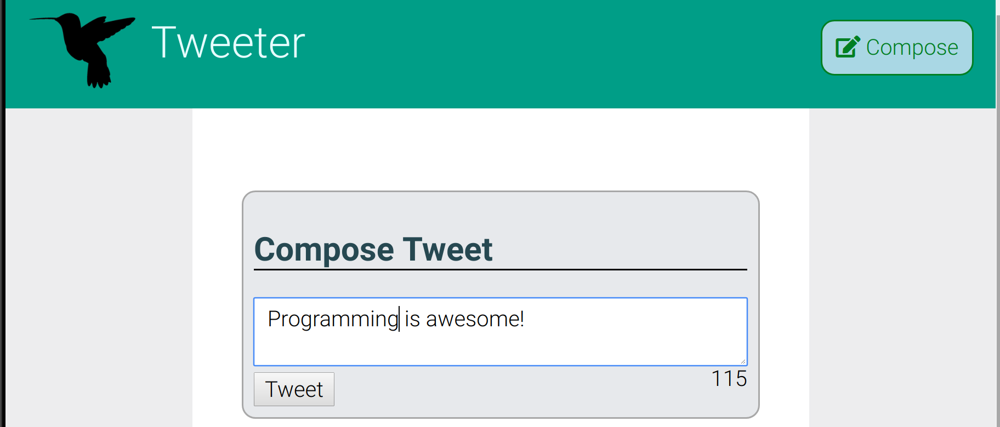
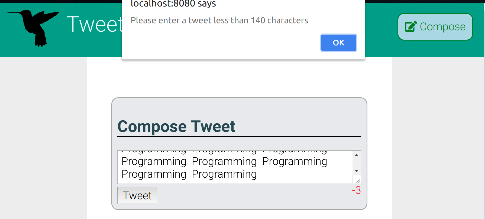
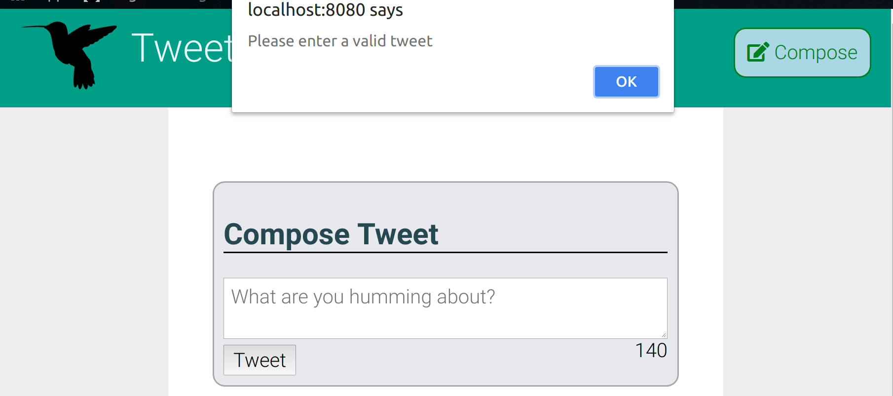

# Tweeter Project

Tweeter is a simple, single-page Twitter clone.

It includes HTML, CSS, AJAX ,jQuery for front-end. For backend, Node, Express, and MongoDB.

## Features
1. It allows users to write a new tweet and it will output the tweet
2. Length of tweet is tracked and alerted when it exceeds 140 characters or has 0 characters
3. Stores values in a mongo database

## Getting Started

1. Fork this repository, then clone your fork of this repository.
2. Install dependencies using the `npm install` command.
3. Start the web server using the `npm run local` command. The app will be served at <http://localhost:8080/>.
4. Go to <http://localhost:8080/> in your browser.

## Dependencies

- Express
- Node 5.10.x or above
- Body-parser
- chance
- express
- mongodb

## Screenshots

### 1. Tweet Display

### 2. New Tweet

### 3. Invalid tweets

